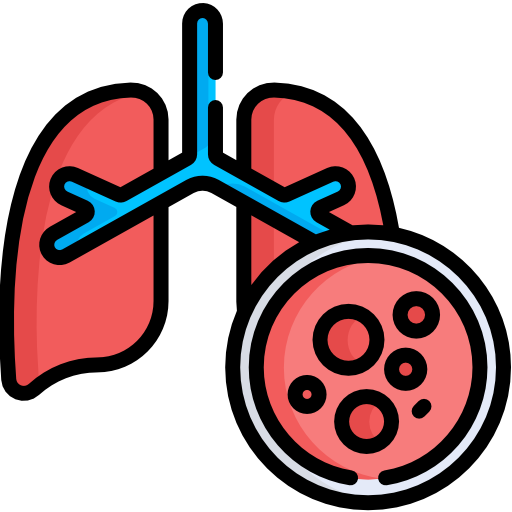
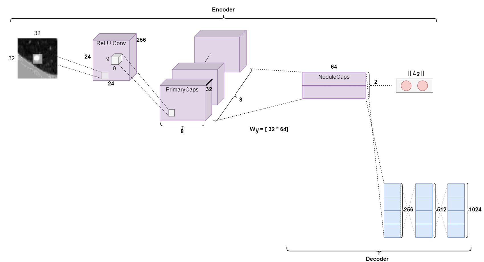

# EasyNodule - AI-Driven Pulmonary Nodule Classification
<div align="center">
  <a href="#">
    
  </a>

<div>
    <a href="https://www.kaggle.com/datasets/yidhir123/lungcancernodules-segmented"></a>
  </div>
  <br>
</div>

Welcome to **EasyNodule** – a powerful desktop application designed to help medical professionals classify pulmonary nodules detected in CT scans efficiently and accurately. EasyNodule leverages state-of-the-art deep learning models to streamline lung cancer diagnostics, ensuring early detection and providing specialists with advanced tools for patient management.

## Table of Contents

1. [About EasyNodule](#about-easynodule)
2. [Features](#features)
3. [Installation](#installation)
4. [Usage Guide](#usage-guide)
5. [Deep Learning Models](#deep-learning-models)
6. [Application Workflow](#application-workflow)
7. [Contributing](#contributing)


## About EasyNodule

EasyNodule is a desktop application aimed at supporting clinicians and specialists in the early detection of lung cancer. It uses an advanced capsule network model **NoduleCaps32** developed by us from scratch based on the original [article](
https://doi.org/10.48550/arXiv.1710.09829). EasyNodule leverages a [dataset](https://www.kaggle.com/datasets/yidhir123/lungcancernodules-segmented) of segmented CT scans available on Kaggle to train and validate the model. By analyzing  these segmented CT scan, EasyNodule offers a streamlined workflow for diagnostic decision-making, empowering medical professionals to diagnose lung cancer in its earliest stages and improve patient outcomes.


**Authors:**

- LABCHRI Amayas [SpeedKillsx](https://github.com/SpeedKillsx) 
- KOULAL Yidhir Aghiles [Y1D1R](https://github.com/Y1D1R)

Developed as part of a Master's thesis project at the University of Science and Technology Houari Boumediene, EasyNodule combines artificial intelligence techniques with medical imaging to provide an easy-to-use and comprehensive solution for pulmonary nodule management.

## Features

- **Personal Account System**: Users can create secure personal accounts to store and access data safely.
- **Patient Management and Database Storage**: Manage patient information and store data securely for easy access.
- **Nodule Classification Using Deep Learning**: Utilize **NoduleCaps32**, a CapsNet model developed for pulmonary nodule classification.
- **Semi-3D Nodule Classification**: Extract insights from 3D segmented CT images for enhanced analysis and diagnosis.
- **Medical Report Generation**: Generate and store detailed medical reports in PDF format.
- **Statistics Dashboard**: Visualize key patient and diagnostic data to aid in analysis and decision-making.

## Installation

### Steps to Install

1. Clone the repository:
   ```bash
   git clone https://github.com/Y1D1R/EasyNodule_Fork.git
   cd EasyNodule_Fork
   ```
2. Create a virtual environment and activate it:
   ```bash
   python -m venv venv
   source venv/bin/activate  # On Windows use `venv\Scripts\activate`
   ```
3. Install the dependencies:
   ```bash
   pip install -r requirements.txt # Ensure cairo is included as a dependency for PDF rendering and install gtk3-runtime
   ```
4. Launch the application:
   ```bash
   python main.py
   ```

## Usage Guide

To get started with EasyNodule, follow these steps:

1. **Sign Up / Login**: Create an account or login with your existing credentials to access the application features.
2. **Add a Patient**: Register patient information (name, age, gender, etc.) for future reference and classification.
3. **Select Patient & Upload segmented CT Scan**: Select the patient and upload a segmented CT scan for nodule classification.
4. **Classify Nodules**: Use the integrated deep learning model to classify nodules as benign or malignant. You may select different classification methods (strict, majority, or threshold-based) depending on the analysis needed.
5. **Generate Reports**: Generate a PDF report including classification results, assessments, and recommendations.
6. **View Statistics**: Visualize trends and patient data, including the prevalence of malignant nodules by region and risk factors such as smoking and family history.

For more details, please refer to the comprehensive user guide included in the repository or access the [EasyNodule User Guide](https://drive.google.com/file/d/17CHbUR6hFuHHutq4315FIcD0YL-yEEI3/view?usp=sharing).

## Deep Learning Models

EasyNodule employs **NoduleCaps32**, a customized Capsule Network model inspired by Hinton's capsule network concept. This model is specifically designed for handling the complexity of 3D medical imaging data, extracting features from CT scans, and improving the accuracy of pulmonary nodule classification.

<div align="center">
  <a href="#">
    
  </a>
</div>  

The final classification decision is made by:

- **Strict Classification**: Requires agreement among all models.
- **Majority Classification**: Takes the most frequent prediction among models.
- **Threshold Classification**: Applies a set confidence threshold for classification.

In cases of disagreement, **Game Theory** is applied to determine the most probable outcome, enhancing classification robustness.

## Application Workflow

EasyNodule is structured around the following workflow:

1. **Data Preprocessing**: CT scans are pre-segmented, and 2D slices are extracted from 3D images in multiple views (x, y, z).
2. **Feature Extraction**: Capsule networks analyze the extracted slices, leveraging **Gabor filters** for enhanced edge detection.
3. **Classification**: The **NoduleCaps32** model classifies nodules with transparency, and disagreements are handled using **game-theoretic approaches**.
4. **User Interaction**: Through an intuitive GUI built with **PyQt** and **PySide**, users can add patients, classify nodules, generate reports, and visualize statistics seamlessly.

## Contributing

We welcome contributions from the community. If you wish to contribute, please follow these steps:

1. Fork the repository.
2. Create a new branch (`git checkout -b feature-branch`).
3. Commit your changes (`git commit -m 'Add some feature'`).
4. Push to the branch (`git push origin feature-branch`).
5. Open a Pull Request.


We hope EasyNodule helps improve the diagnosis and treatment of lung conditions. If you have any questions or need support, feel free to reach us at [koulalyidhiraghiles@gmail.com](mailto:koulalyidhiraghiles@gmail.com) or [amayaslabchri88@gmail.com](mailto:amayaslabchri88@gmail.com).

**YouTube Presentation**: [Watch Our Youtube Video](https://youtu.be/DerCbbJpCoQ)

Happy diagnosing!

---

*"AI-powered nodule classification is a game-changer in the fight against lung diseases, bringing us closer to a future where early detection saves lives." - Dr. Lisa Sanders*

